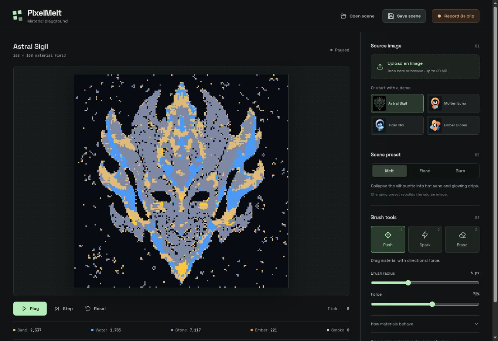

# PixelMelt

[Try PixelMelt in your browser](https://dicnunz.github.io/demos/pixelmelt/)



PixelMelt is a desktop-first, local-only web app that turns a single image into a live falling-material simulation. Upload an image, convert it into a low-resolution material field, then melt it, flood it, burn it, poke it, and export an 8-second WebM clip without leaving the browser.

The entire product runs client-side. There is no backend, no auth, no database, and no paid API dependency.

Best results come from faces, masks, flowers, logos, and other bold silhouettes with clear contrast and some negative space around the subject.

## Highlights

- Upload one image and convert it into a 168x168 material map.
- Run the simulation in a Web Worker and render it with crisp nearest-neighbor upscaling on HTML5 Canvas.
- Switch between three scene presets: `Melt`, `Flood`, and `Burn`.
- Interact directly with the simulation using `Push`, `Spark`, and `Erase`.
- Save exact simulation snapshots as `.pixelmelt` scene files and reopen them later.
- Pause, advance one tick, reset, or use keyboard shortcuts from a canvas-first workspace.
- Export an 8-second WebM clip from the live canvas.
- Start instantly with four seeded demo images included in the repo, including the generated `Astral Sigil` mask.
- Deploy the build output as a static site.

## Stack

- Vite
- React 19
- TypeScript
- Tailwind CSS v4
- Zustand
- HTML5 Canvas
- Web Worker
- Vitest
- Playwright (local browser validation)

## Quick Start

```bash
npm install
npm run dev
```

Then open the local Vite URL printed in the terminal.

Useful commands:

```bash
npm run lint
npm test
npm run build
npm run preview
npm run check
```

## Demo Flow

1. Launch the app. `Astral Sigil` loads automatically, paused so you can inspect it.
2. Click `Play` to start the simulation, or `Step` to advance a single tick.
3. Click `Melt`, `Flood`, or `Burn` to rebuild the scene from the same source image.
4. Drag on the stage with `Push` to shove loose material around.
5. Switch to `Spark` and click into the scene to create ember bursts and smoke.
6. Switch to `Erase` to carve vents or remove buildup.
7. Upload your own image with the drop zone or file picker.
8. Click `Save scene` to keep an editable snapshot, or `Record 8s clip` to export a WebM of the live simulation.

## Save and Resume a Scene

`Save scene` downloads a `.pixelmelt` file with the current material and charge maps, simulation tick and seed, original source material map, preset, and brush settings. Saving requests a fresh worker snapshot, including brush events queued before the save. The original source image itself is not required to reopen the scene.

Use `Open scene` to restore a file. Restored scenes always open **paused**, retaining the saved tick and seed so the simulation can continue exactly in this engine version. Presets and `Reset` still rebuild from the original source map. An image upload starts a new source; opening a scene restores an existing experiment.

Scene files use a versioned JSON format, fixed to the 168×168 grid. Imports validate both complete maps, material IDs, byte values, settings, and version before committing them. Invalid or unsupported files show an error while the last usable scene remains available. Files larger than 1 MB are rejected before reading. Image uploads are limited to 20 MB.

There is no automatic browser persistence: download a scene before refreshing or closing the page. Scene files contain the source's material representation, so treat them as you would the source image when sharing.

| Shortcut | Action |
| --- | --- |
| Space | Play / pause |
| 1, 2, 3 | Push, Spark, Erase |
| [ and ] | Decrease / increase brush radius |
| . | Advance one tick while paused |

Shortcuts leave text fields and sliders alone. Mouse and touch drawing both work on the canvas.

## Source Image Tips

- High-contrast subjects read best at `168x168`.
- Clear silhouettes usually produce the most dramatic melt and burn passes.
- Transparent or simple backgrounds convert more cleanly than busy photos.
- The included `Astral Sigil` source is a good stress test: sharp glass edges, black negative space, and hot stone details make the burn and melt presets visibly different.
- Portraits, icons, flowers, masks, and graphic shapes are the sweet spot.

## How It Works

### 1. Image Conversion

The uploaded image is rasterized into a square 168x168 working grid. A conversion pass samples luminance, saturation, alpha, and background similarity to classify each cell as one of:

- `sand`
- `water`
- `stone`
- `ember`
- `smoke`
- `empty`

The conversion output becomes the base scene for all presets.

### 2. Preset Rebuilds

Each preset is a deterministic transform on top of the base material map:

- `Melt` weakens exposed stone into sand and seeds hot drips near the lower silhouette.
- `Flood` pushes water across the top edge and left side of the scene.
- `Burn` ignites exposed surfaces and seeds smoke above hot cells.

Because presets rebuild from the base snapshot, users can switch modes without re-uploading the image.

### 3. Simulation Loop

The simulation runs inside [`src/workers/simulation.worker.ts`](./src/workers/simulation.worker.ts). The worker advances the grid at 60 FPS and posts frames back to the main thread at 30 FPS.

The core update rules live in pure modules under [`src/sim`](./src/sim):

- [`src/sim/simulation.ts`](./src/sim/simulation.ts): particle stepping rules
- [`src/sim/tools.ts`](./src/sim/tools.ts): push, spark, erase brushes
- [`src/sim/presets.ts`](./src/sim/presets.ts): preset transforms
- [`src/sim/image-to-material.ts`](./src/sim/image-to-material.ts): source image conversion

The canvas renderer in [`src/components/CanvasStage.tsx`](./src/components/CanvasStage.tsx) draws the low-resolution frame buffer into a larger display canvas with image smoothing disabled, keeping the pixel edges sharp.

### 4. Scene Files and Loading

[`src/lib/scene-file.ts`](./src/lib/scene-file.ts) owns the validated scene-file contract. [`src/lib/use-scene-workspace.ts`](./src/lib/use-scene-workspace.ts) coordinates source changes, import/export, and playback. [`src/lib/latest-loader.ts`](./src/lib/latest-loader.ts) ensures that delayed uploads or demo responses cannot overwrite a newer request. A failed source load preserves the last committed scene.

Worker load and snapshot requests carry IDs, acknowledge completion, and reject on worker failure or timeout. Loading a snapshot preserves its tick and sets the paused state in the same worker message.

### 5. Clip Export

PixelMelt records directly from the display canvas using `canvas.captureStream()` and `MediaRecorder`. Export is intentionally fixed to 8 seconds so the output is lightweight and easy to share, and the downloaded file name includes the active source and preset.

## Project Structure

```text
public/demo/                  Seeded SVG/PNG demo images
docs/pixelmelt-workspace.jpg   Current workspace screenshot
src/components/               React UI and canvas stage
src/lib/                      Worker bridge, rasterizer, recorder, helpers
src/sim/                      Pure simulation, conversion, presets, and tests
src/store/                    Zustand UI state
src/workers/                  Simulation worker entrypoint
```

## Validation

Checks available in this repository:

- `npm run lint`
- `npm test`
- `npm run build`

## Static Deployment

PixelMelt builds to plain static assets:

```bash
npm run build
```

Deploy the resulting `dist/` directory to any static host. No environment variables are required. For a subdirectory, pass Vite's base path; bundled demo assets and worker chunks use that base:

```bash
npm run build -- --base=/demos/pixelmelt/
```

Tests cover deterministic stepping, image conversion, exact scene-file roundtrips and continuation, corrupt-file rejection, concurrent source loads, worker acknowledgements and failures, and React workspace recovery.

## Browser Notes

- WebM recording works best in current Chromium-based browsers and Firefox.
- The app is intentionally desktop-first. It will render on smaller screens, but the interaction model is tuned for mouse and trackpad use.

## License

MIT

## Project status

AI-assisted personal project. Bundled examples and tests demonstrate a limited scope; they are not evidence of production use or independent validation.
